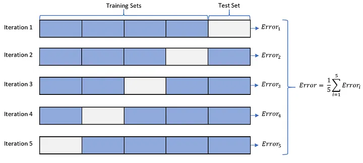

---
author:
- Dmitri Ollari Ischimji
bibliography:
- ./Bibliografia.bib
title: Addestramento di una rete neurale encoder-decoder con dati
  limitati per la segmentazione del femore fetale da immagini
  ecografiche
---

::: flushright
*Dedicato a Diego*
:::

# Introduzione {#chap:Introduzione}

La segmentazione semantica riveste un ruolo cruciale nell'ambito
dell'analisi delle immagini mediche, consentendo d'identificare e
isolare strutture anatomiche d'interesse. Questa tesi si concentra
sull'applicazione di reti neurali convoluzionali (CNN) e, in
particolare, sull'utilizzo dell'architettura U-Net per eseguire la
segmentazione binaria d'immagini ecografiche fetali al fine di estrarre
e delineare i femori.

Le immagini ecografiche fetali rappresentano una sfida complessa
nell'ambito della segmentazione, richiedendo un'accurata identificazione
delle strutture anatomiche, come i femori, per fini diagnostici e
monitoraggio della crescita fetale. La segmentazione binaria semantica
si concentra sull'etichettare pixel specifici dell'immagine associati ai
femori, consentendo una comprensione dettagliata delle strutture
anatomiche in esame.

L'approccio adottato in questa tesi si basa sull'utilizzo della rete
neurale convoluzionale U-Net, una struttura architetturale nota per la
sua efficacia nella segmentazione d'immagini biomediche. La peculiarità
di U-Net risiede nella sua capacità di catturare dettagli locali
mantenendo, allo stesso tempo, una visione globale dell'immagine,
rendendola particolarmente adatta per problemi di segmentazione
dettagliata come l'estrazione dei femori dalle ecografie fetali.

Attraverso l'analisi, l'implementazione e l'ottimizzazione di questa
architettura, il lavoro si propone di migliorare l'accuratezza e
l'efficienza della segmentazione, fornendo uno strumento affidabile per
l'identificazione automatica dei femori nelle immagini ecografiche
fetali. L'obiettivo è quello di apportare un contributo positivo
all'avanzamento delle tecnologie di estrazione delle informazioni dalle
immagini ecografiche fetali, automatizzando e facilitando una
valutazione più precisa della crescita fetale allo scopo di analizzare
la densità minerale ossea fetale(BMD).

# Lavori correlati {#chap:related_works}

## Segmentazione {#sec:segmentazione}

<figure id="fig:segmentazione">

 

<figcaption>Segmentazione semantica</figcaption>
</figure>

La segmentazione semantica rappresenta un campo di grande interesse e
rilevanza nell'ambito dell'elaborazione delle immagini e della visione
artificiale. Questa tecnica si distingue per la sua capacità
d'interpretare il contenuto delle immagini a un livello semantico,
andando oltre la semplice divisione dell'immagine in regioni omogenee
basate su caratteristiche visive come il colore o la texture. Nello
specifico, la segmentazione semantica si prefigge l'obiettivo di
attribuire un'etichetta semantica a ogni singolo pixel dell'immagine,
consentendo così d'identificare e categorizzare le diverse parti che
compongono la scena. L'obiettivo principale della segmentazione
semantica è quello di fornire una comprensione approfondita del
contenuto visivo presente in un'immagine. Ciò si traduce nella capacità
d'identificare e categorizzare oggetti e regioni, rendendo possibile
un'analisi dettagliata e una migliore interpretazione dei dati visivi.
Un esempio di applicazione della segmentazione semantica la si può
visionare nella figura [2.1](#fig:segmentazione){reference-type="ref"
reference="fig:segmentazione"}, in questo caso l'obiettivo della
segmentazione era quello di estrapolare le informazioni relative al
motociclista in una classe e le informazioni relative al veicolo in
un'altra classe, separando entrambe le classi dallo sfondo.

## Fully Convolutional Network

<figure id="fig:cnn">

<figcaption>CNN</figcaption>
</figure>

[]{#sec:fcn label="sec:fcn"} L'articolo *Fully Convolutional Networks
for Semantic Segmentation* [@long2015fully] propone l'utilizzo di una
tipologia di reti neurali convoluzionali (CNN) che permettono grazie
all'assenza di layer completamente connessi di elaborare immagini di
qualunque dimensione. Questa nuova tipologia di reti migliora
notevolmente le capacità di apprendimento delle reti neurali permettendo
di produrre mappe di segmentazione più precise grazie alla loro capacità
di apprendimento d'informazioni spaziali.

Le motivazioni riguardanti l'ampio utilizzo nel settore della *computer
vision* sono legate all'assenza di strati completamente connessi
(lineari) che vincolano l'ingresso alla medesima grandezza per ogni
singola immagine, permettendo di fornire in ingresso l'intera immagine e
non frammenti della stessa così da aumentare l'apprendimento spaziale
della rete.

Questa maggior flessibilità comporta un addestramento libero da
limitazioni sull'ingresso comportando una maggiore tolleranza agli
errori e al rumore rendendo questa tipologia di reti particolarmente
adatte a contesti poveri di dati.

## U-Net {#sec:unet}

<figure id="fig:unet">

<figcaption>U-Net</figcaption>
</figure>

### U-Net: Convolutional Networks for Biomedical Image Segmentation

Nel 2015, Olaf Ronneberger, Philipp Fischer e Thomas Brox hanno
introdotto un nuovo modello di rete neurale convoluzionale chiamato
*U-Net* per la segmentazione semantica d'immagini biomedicali
[@ronneberger2015unet]. Questa rete è stata progettata specificamente
per affrontare le sfide associate alla segmentazione d'immagini
biomedicali, come la necessità di segmentare strutture anatomiche
precise con un numero limitato d'immagini di addestramento.

Il modello *U-Net* è caratterizzato da una struttura simmetrica, in cui
la parte \"contrattiva\" (downsampling) cattura il contesto e la parte
\"espansiva\" (upsampling) permette una localizzazione precisa. Questa
struttura consente alla rete di combinare le informazioni di contesto
con quelle locali, migliorando la precisione della segmentazione.

Una delle principali innovazioni della *U-Net* è l'introduzione di
collegamenti a salti tra le parti contrattive ed espansive. Questi
collegamenti trasferiscono le caratteristiche spaziali ad alta
risoluzione dalla parte contrattiva a quella espansiva, consentendo una
maggiore precisione nella localizzazione delle strutture segmentate.

Il modello *U-Net* ha dimostrato di ottenere risultati di segmentazione
di alta qualità su diverse applicazioni biomedicali con un numero
limitato d'immagini di addestramento, rendendolo uno strumento
fondamentale per la segmentazione semantica in ambito biomedico.

## Segmentazione ossea {#sec:segmentazione_ossea}

Il lavoro *Towards whole-body CT Bone Segmentation*
[@10.1007/978-3-662-56537-7_59] costituisce un'importante analisi volta
a sviluppare metodi e algoritmi avanzati per la segmentazione ossea in
immagini ottenute tramite tomografia computerizzata (TC) di tutto il
corpo. Il documento si concentra sull'importanza della segmentazione
ossea nell'ambito medico per diagnosticare condizioni patologiche e
condurre analisi dettagliate del tessuto osseo.

Il contributo principale dell'articolo consiste nella valutazione di
approcci innovativi e nell'ottimizzazione di tecniche algoritmiche per
identificare e isolare accuratamente le strutture ossee nelle immagini
TC. Sottolinea l'utilizzo di metodologie avanzate di elaborazione delle
immagini e l'applicazione di algoritmi di visione artificiale e machine
learning per ottenere una segmentazione precisa.

L'articolo è rilevante nell'ambito dell'informatica medica in quanto
evidenzia l'applicazione di soluzioni informatiche per l'analisi
approfondita delle immagini mediche, sottolineando l'importanza delle
tecniche di segmentazione ossea per fini clinici e di ricerca biomedica.

## Segmentazione di vasi sanguigni {#sec:segmentazione_vasi_sanguigni}

L'articolo *Accurate Retinal Vessel Segmentation via Octave Convolution
Neural Network* [@fan2020accurate] propone un approccio innovativo per
la segmentazione precisa dei vasi sanguigni retinici utilizzando le reti
neurali a convoluzione ottava. Questa segmentazione è un'importante fase
nell'analisi delle immagini retiniche in ambito medico.

L'articolo esamina il vantaggio delle reti neurali a convoluzione
ottava, un tipo di rete neurale che sfrutta differenti frequenze
spaziali per catturare dettagli a diverse scale. Questo approccio
consente di migliorare la segmentazione dei vasi sanguigni retinici,
consentendo una migliore comprensione e diagnosi di patologie oculari.

Il lavoro si concentra sull'efficacia delle reti neurali a convoluzione
ottava nel rilevare e isolare i vasi sanguigni della retina,
evidenziando come questo approccio abbia portato a risultati più
accurati rispetto a metodi convenzionali.

In conclusione, l'articolo *Accurate Retinal Vessel Segmentation via
Octave Convolution Neural Network* costituisce un contributo
significativo nell'ambito della segmentazione vascolare retinica,
evidenziando l'efficacia delle reti neurali a convoluzione ottava e la
loro importanza nella diagnostica medica.

# Metodi {#cha:Metodi}

## Dati

Tutti i dati provengono da analisi ecografiche effettuate presso
**Azienda Ospedaliera Universitaria Parma**, sono stati raccolti nel
periodo compreso tra **Aprile 2022** e **Gennaio 2023** da un team di
**medici esperti** e sono stati applicati dei parametri per
standardizzare le immagini raccolte:

-   Indice di massa corporea (BMI)

-   Età

-   Problematiche durante la gravidanza

-   Problematiche dopo la gravidanza

-   Femore centrato nell'inquadratura

Le immagini hanno subito un processo di *preprocessing* aggiuntivo per
uniformare le dimensioni e la risoluzione. In particolare, sono state
ridimensionate a immagini **$1280px$ di larghezza** e **$876px$ di
altezza**.

Inoltre data che il problema è categorizzato come problema di
segmantazione semantica binomiale, si è scelto di convertire le immagine
da **RGB** a immagini in **scala di grigi** per ridurre la complessità
del problema e per ridurre il quantitativo di dati necessari per
l'addestramento della rete.

Sono state realizzate manualmente delle **maschere** di segmantazione
per ogni immagine, in modo da avere un *ground truth* da confrontare con
le predizioni del modello.

Data la scarsa quanti di dati a disposizione per l'addestramento della
U-Net, si è scelto di utilizzare alcune tecniche di *data augmentation*
per aumentare la quantità di dati a disposizione. In particolare si è
scelto di utilizzare le seguenti tecniche applicate in modo casuale per
ogni coppia **immagine-maschera**

-   *Flip* orizzontale e verticale

-   *Rotazioni* di $35^{\circ}$

-   *Rumore* Gaussiano

Queste tecniche di *data augmentation* migliorano notevolmente le
segmentazioni ottenute mediante la rete U-Net e rendono la rete più
robusta a variazioni di luce e a rumore presente nelle immagini.

{#fig:data_augmentation
width="80%"}

L'ottimo risultato ottenuto è in buona parte dovuto alla *data
augmentation* effettuata nella fase di addestramento del modello, la
*data augmentation* ha migliorato l'adattabilità a contesti non
controllati migliorando così la generalizzazione del modello.

Come si può notare dalla
[\[fig:data_augmentation\]](#fig:data_augmentation){reference-type="autoref"
reference="fig:data_augmentation"} la *data augmentation* è stata
effettuata in modo casuale per ogni coppia **immagine-maschera** ed è
stata applicata solo nella fase di addestramento, lasciando cosi
invariate le immagini inerenti al controllo del modello.

## Etichettatura

Le immagini utilizzate per l'addestramento della rete sono state fornite
da **Azienda Ospedaliero-Universitaria di Parma** e sono state
etichettate manualmente mediante l'uso di un software di etichettatura
chiamato **LabelMe** [@labelme].

Il processo di etichettatura della immagini prevede per ogni immagine
l'applicazione di indicatori che delimitano il perimetro del femore,
potendolo così isolare dal resto dell'immagine.

## Modello

Il modello dal quale si è partiti prende il nome di
**U-Net**([\[fig:unet\]](#fig:unet){reference-type="autoref"
reference="fig:unet"}), la sua realizzazione iniziale è stata effettuata
seguendo lo studio di Olaf Ronneberger, Philipp Fischer e Thomas Brox
del 2015 [@ronneberger2015unet].

Lo studio propone un'architettura di rete neurale convoluzionale per la
segmentazione semantica di immagini biomediche, classificando ogni
singolo pixel dell'immagine in una delle varie categorie del problema
analizzato, la rete convoluzionale emersa da quesa analisi rimane
tutto'oggi una delle più utilizzate in ambito medico per la
segmentazione semantica data la sue performace e la sua versatilità.

L'implementazione iniziale ricalca il modello realizzato da Olaf
Ronneberger, Philipp Fischer e Thomas Brox, utilizzando il framework
**PyTorch** [@pytorch] come base per la realizzazione della rete.

L'architettura proposta da Olaf Ronneberger, Philipp Fischer e Thomas
Brox è composta di 4 parti principali:

-   **Encoder**: Visionabile graficamente come la parte discenente della
    U-Net

-   **Bridge**: Visionabile graficamente come la linea di congiunzione
    fra la parte discendente e la parte ascendente della U-Net

-   **Decoder**: Visionabile graficamente come la parte ascendente della
    U-Net

-   **Output**: Visionabile graficamente come l'ultimo layer della U-Net

Le applicazioni che si appogiano a modelli derivati dall'architettura
U-net dominano settori come la medicina e la biologia, in particolare la
segmentazione di immagini biomediche, come la segmentazione di immagini
ecografiche, la segmentazione di immagini TC e la segmentazione di
immagini RM.

Le cause principali di tale successo possono essere ricondotte a:

-   **Segmentazione dettagliata**: U-Net è in grado di produrre
    segmentazioni dettagliate e precise grazie alle sue innovative
    \"skip connections\" che permettono al modello di catturare sia i
    dettagli di basso livello che il contesto di alto livello.

-   **Architettura compatta**: Nonostante la sua capacità di catturare
    dettagli, il modello è relativamente snello e può essere addestrato
    con successo anche con dataset di dimensioni moderate.

-   **Adattabilità**: U-Net è stata originariamente concepita per
    applicazioni mediche, ma si è dimostrata estremamente versatile e
    può essere utilizzata con successo in una vasta gamma di contesti.

Ovviamente, come ogni modello, U-Net ha anche alcuni svantaggi. Il
principale è la necessità di un dataset di addestramento ampio e
accuratamente etichettato. Questo aspetto può essere un ostacolo,
soprattutto in contesti in cui la disponibilità di dati è limitata.
Inoltre, U-Net richiede una quantità significativa di memoria per
memorizzare i pesi del modello, il che può diventare un problema quando
si lavora con immagini ad alta risoluzione.

### Convoluzione {#sec:convoluzione}

La convoluzione è una delle operazini fondamentali utilizzate nelle reti
neurali convoluzionali per estrarre le caratteristiche significative da
un'input, la convoluzione coinvolge un filtro (o kernel) e l'input su
cui si applica.

Il processo di convoluzione consiste nell'sommare ogni elemento di
un'immagine al suo vicino, pesando ogni singola operazione mediante
l'utilizzo del filtro(o kernel) il calcolo della feature map di uscita è
calcolata come segue: $$\begin{aligned}
  &\Bigg( \begin{bmatrix}
    a & b & c \\
    d & e & f \\
    g & h & i
  \end{bmatrix}
  *
  \begin{bmatrix}
    1 & 2 & 3 \\
    4 & 5 & 6 \\
    7 & 8 & 9
  \end{bmatrix}
  \Bigg) [2, 2] =\\
  &= (i \cdot 1) + (h \cdot 2) + (g \cdot 3) + (f \cdot 4) + ( e \cdot 5 ) + ( d \cdot 6 ) + c \cdot 7) + (b \cdot 8) + (a \cdot 9)
\end{aligned}$$

### Max pooling {#sec:Max pooling}

Il *max pooling* è un'operazione chiave all'interno della rete U-Net e
delle reti neurali convoluzionali (CNN) in generale.

Il *max pooling* è utilizzato per ridurre la dimensione delle feature
map, consentendo di ridurre la complessità del problema da approssimare,
comportando una maggior resistenza all'*overfitting*, migliorando la
capacitá di generalizzazione del modello e di ottenere una
rappresentazione più invariante rispetto alle piccole variazioni
spaziali nell'input.

### Encoder {#sec:Encoder}

La fase di *encoding* è la prima fase della rete U-Net, composta da una
serie di strati di
convoluzione([3.3.1](#sec:convoluzione){reference-type="ref"
reference="sec:convoluzione"}) e max
pooling([3.3.2](#sec:Max pooling){reference-type="ref"
reference="sec:Max pooling"}) che riducono progressivamente la
dimensione spaziale dell'immagine mentre aumentano il numero di canali
di *features*.

Nello specifico, la fase di *encoding* è composta da 3 parti principali:

-   **Strato iniziale**: Questo strato applica diverse operazioni di
    convoluzione ai dati di input per estrarre le caratteristiche di
    basso livello, come bordi e texture. Queste operazioni iniziali
    consentono al modello di comprendere dettagli fondamentali
    dell'immagine.

-   **Downsampling**: Dopo lo strato iniziale, la fase di encoding
    utilizza operazioni di max pooling o convoluzione con un passo
    (stride) superiore a 1 per ridurre la dimensione delle feature map.
    Questo processo di downsampling riduce la risoluzione spaziale, ma
    aumenta il numero di canali delle feature, catturando informazioni
    di livello superiore. Ogni strato di downsampling estrae
    caratteristiche sempre più astratte e globali dall'immagine.

-   **Strati intermedi**: Nel cuore della fase di encoding si trovano
    gli strati intermedi. Questi strati applicano operazioni di
    convoluzione multiple con l'obiettivo di catturare caratteristiche
    di complessità crescente. A ogni strato intermedio, le feature map
    si allargano, consentendo al modello di comprendere dettagli più
    ampi e contestuali. Questi strati intermedi sono cruciali per
    l'acquisizione di informazioni di alto livello.

### Bridge {#sec:Bridge}

Il *bridge* è un'innovazione dell'architettura U-Net che contribuisce in
modo significativo alla precisione della segmentazione delle immagini.

La fase di *bridge* permette di trasferire informazioni rilevanti tra
l'encoder e il decoder attraverso skip connections, che consentono il
trasferimento di informazioni rilevanti. Questo approccio multi-scala è
fondamentale per ottenere una segmentazione precisa delle immagini,
poiché consente al modello di considerare dettagli sia di basso che di
alto livello durante il processo di segmentazione.

### Decoder {#sec:Decoder}

Nella rete U-Net, la fase di decoding é responsabile della ricostruzione
dell'immagine segmentata a partire dalle informazioni estratte durante
l'encoding. Questa fase é fondamentale per ottenere una segmentazione di
alta qualitá.

Le fasi principali del *decoder* sono:

-   **Upsampling**: La fase di decoding inizia con l'operazione di
    upsampling, che serve a ripristinare gradualmente la dimensione
    delle feature map ai livelli originali dell'immagine. Ciò viene
    fatto utilizzando operazioni come la trasposta della convoluzione
    (deconvoluzione) o l'interpolazione bilineare. L'obiettivo è
    ottenere feature map di dimensioni compatibili con quelle
    dell'immagine di input.

-   **Skip Connections**: Un aspetto distintivo della U-Net sono le skip
    connections, o connessioni di salto. Queste connessioni collegano le
    feature map estratte durante l'encoding alle corrispondenti feature
    map nella fase di decoding. Ciò consente di combinare informazioni
    multi-scala, in modo che il modello possa accedere sia a dettagli
    fini che a contesto di alto livello. Le skip connections sono
    fondamentali per migliorare la precisione della segmentazione.

-   **Convoluzione nel Decoding**: Dopo l'upsampling e l'integrazione
    delle skip connections, vengono applicate operazioni di convoluzione
    per raffinare ulteriormente le feature map. Queste convoluzioni
    possono avere lo scopo di \"mescolare\" le informazioni o di
    catturare dettagli specifici a livelli più alti.

### Output {#sec:Output}

La parte finale della rete U-Net é composta da uno o più strati di
convoluzione che riducono la profondità delle feature map alla
dimensione desiderata per l'output finale. Questi strati producono
l'immagine segmentata in cui ogni pixel è etichettato con la classe di
appartenenza (esempio: sfondo, oggetto, ecc.).

## Rimozione sliding window {#sub:Rimozione sliding window}

Grazie agli avanzamenti tecnologici portati avanti negli anni da
costruttori hardware e software, si è riusciti a ridurre notevolmente i
tempi di elaborazione delle immagini e la grandezza massima delle
immagini che possono essere elaborate.

Si è quindi scelto di rinunciare all'approccio sliding window che
risulta più conservativo in termini di memoria e di tempo di
elaborazione, per un approccio più moderno che sfrutta la potenza di
calcolo delle GPU e la loro memoria dedicata notevolmente più grande
rispetto alle GPU del passato.

Un *effetto collaterale* riscontrato con l'utilizzo di immagini intere è
quello della miglior comprensione spaziale delle immagini da parte della
rete, questo effetto è dovuto al fatto che la rete ha a disposizione
l'intera immagine e non solo una parte di essa, questo permette alla
rete di comprendere meglio il contesto spaziale dell'immagine e di
migliorare la segmentazione.

## Modifica Encoder-Decoder

Mediante svariate prove si è notato che aumentando il numero di
iterazioni di convoluzione nei vari strati di encoding e decoding, si
ottengono risultati migliori in termini di segmentazione a scapito di un
aumento del tempo di elaborazione e del consumo di memoria.

Si è quindi scelto di modificare le fasi di *decoding* e di *encoding*:

::: {#tab:encoding_originale}
   **Layer**   **In channels**   **Out channels**
  ----------- ----------------- ------------------
    Encoder           1                 64
    Encoder          64                128
    Encoder          128               256
    Encoder          256               512
    Decoder         1024               512
    Decoder          512               256
    Decoder          256               128
    Decoder          128                64

  : Encoding e Decoding originale
:::

::: {#tab:encoding_modificato}
   **Layer**   **In channels**   **Out channels**
  ----------- ----------------- ------------------
    Encoder           1                 16
    Encoder          16                 32
    Encoder          32                 64
    Encoder          64                128
    Encoder          128               256
    Encoder          256               512
    Decoder         1024               512
    Decoder          512               256
    Decoder          256               128
    Decoder          128                64
    Decoder          64                 32
    Decoder          32                 16

  : Encoding e Decoding modificati
:::

L'idea alla base di questa modifica risiede nel significato intrinseco
dell'operazione di convoluzione e di max pooling, aggiungendo iterazioni
di convoluzioni, si permette alla rete in primo luogo di estrarre più
feature importanti alla classificazione dei pixel e successivamente
mediante il max pooling si eliminano le feature meno importanti e si
riduce la dimensione delle feature map.

## Metriche {#sec:metriche}

Considerando la tipologia di *task* si è pensato di usare la metrica
*Dice BCE Loss* per la *loss* e *Intersection over Union* per
l'*accuratezza*.

### Dice BCE Loss

{#fig:dice_loss
width="0.7\\columnwidth"}

La Dice Loss è una metrica di perdita basata sul coefficiente di Dice,
che è una misura della somiglianza tra due campioni. È particolarmente
utile per i dati non bilanciati, come è spesso il caso nelle immagini
mediche dove la regione di interesse occupa una piccola parte
dell'immagine. Il coefficiente di Dice è definito dal'equazione
[\[eq:dice_loss\]](#eq:dice_loss){reference-type="ref"
reference="eq:dice_loss"}.

La Binary Cross-Entropy (BCE) Loss è una delle funzioni di perdita più
comuni utilizzate nei problemi di classificazione binaria. È
particolarmente utile quando i dati di output sono probabilità che
variano tra 0 e 1. La BCE Loss misura quanto le predizioni fatte dal
modello si discostano dai veri valori (etichette).

$$\begin{aligned}
	% \text{DiceBCELoss} &= \text{DiceLoss} + \text{BCELoss}
	L & = L_{\text{Dice}} + L_{\text{BCE}}
	\label{eq:dice_bce_loss}
\end{aligned}$$

$$\begin{aligned}
	L_{\text{Dice}} & = 1 - \frac{2\sum_i^N p_i g_i + \varepsilon}{\sum_i^N p_i^2 + \sum_i^N g_i^2 + \varepsilon}
	\label{eq:dice_loss}
\end{aligned}$$

$$\begin{aligned}
	L_{\text{BCE}} & = -\frac{1}{N} \Bigg[ g_i \sum_{i=1}^N p_i + ( 1 - g_i ) \sum_{i=1}^N (1-p_i) \Bigg]
	\label{eq:bce_loss}
\end{aligned}$$

Quindi ne risulta che la *loss* sarà calcolata mediante:
$$\begin{aligned}
	L & = 1 - \frac{2\sum_i^N p_i g_i + \varepsilon}{\sum_i^N p_i^2 + \sum_i^N g_i^2 + \varepsilon} -\frac{1}{N} \Bigg[ g_i \sum_{i=1}^N p_i + ( 1 - g_i ) \sum_{i=1}^N (1-p_i) \Bigg]
	\label{eq:dice_bce_loss_complete}
\end{aligned}$$ Dove:

-   $p_i$ è il valore di *ground truth*

-   $g_i$ è il valore *predetto* dal modello

### Intersection over Union(IoU)

Per la metrica dell'accuratezza della segmentazione, è stata utilizzata
la metrica *Intersection over Union* (IoU), poichè è una metrica che
permette di valutare la capacità di segmentazione del modello facendo il
rapporto tra l'area di intersezione tra la maschera predetta e quella di
*ground truth* e l'area di unione tra le due maschere, formalmente:
$$\begin{aligned}
	\text{IoU} & = \frac{\text{TP}}{\text{TP} + \text{FP} + \text{FN}}
	\label{eq:iou}
\end{aligned}$$

Dove **TP** è il numero di *True Positive*, **FP** è il numero di *False
Positive* e **FN** è il numero di *False Negative*.

## Validazione del modello

La *cross-validation* (validazione incrociata) è una tecnica
fondamentale nell'ambito del machine learning e dell'addestramento di
modelli predittivi. Essenzialmente, la cross-validation è un metodo per
valutare le prestazioni di un modello in modo robusto, valutandolo su
più insiemi di dati per ottenere stime più affidabili delle sue capacità
predittive. Questo processo aiuta a mitigare il rischio di overfitting
(sovradattamento) e offre una migliore comprensione delle prestazioni
del modello.

{#fig:cross_validation
width="70%"}

Fornisce stime più affidabili delle prestazioni del modello, riducendo
il rischio di ottenere stime di prestazioni spurie a causa di una
singola divisione dei dati.

# Risultati sperimentali {#chap:Risultati sperimentali}

## Addestramento {#sec:Addestramento}

Il modello è stato addestrato mediante l'uso della
*cross-validation*([\[fig:cross_validation\]](#fig:cross_validation){reference-type="autoref"
reference="fig:cross_validation"}) con una suddivisione dei dati in
cinque parti uguali(cinque folds).

Essendo una tipologia di apprendimento supervisionata, al modello sono
fornite immagini originali e le loro segmentazioni effettuate
manualmente.

{#fig:addestramento del modello
width="0.7\\columnwidth"}

Effettuando l'addestramento con 5 folds, il modello viene addestrato 5
volte, ogni volta con un fold diverso, l'errore finale è dato dalla
media degli errori ottenuti dalle 5 iterazioni.

<figure id="fig:loss e accuratezza della prima porzione di dati">

 

<figcaption>Errore e accuratezza della prima porzione di
dati</figcaption>
</figure>

<figure id="fig:loss e accuratezza della seconda porzione di dati">

 

<figcaption>Errore e accuratezza della seconda porzione di
dati</figcaption>
</figure>

<figure id="fig:loss e accuratezza della terza porzione di dati">

 

<figcaption>Errore e accuratezza della terza porzione di
dati</figcaption>
</figure>

<figure id="fig:loss e accuratezza della quarta porzione di dati">

 

<figcaption>Errore e accuratezza della quarta porzione di
dati</figcaption>
</figure>

<figure id="fig:loss e accuratezza della quinta porzione di dati">

 

<figcaption>Errore e accuratezza della quinta porzione di
dati</figcaption>
</figure>

L'**errore** complessivo viene calcolato come media dei singoli errori
ottenuti dalle cinque iterazioni mediante la formula
[\[eq:dice_bce_loss_complete\]](#eq:dice_bce_loss_complete){reference-type="ref"
reference="eq:dice_bce_loss_complete"} portando a un errore medio del
**$7.9\%$**.

Mentre l'**accuratezza** complessiva viene calcolata come media delle
singole accuratezze ottenute dalle cinque iterazioni mediante la formula
[\[eq:iou\]](#eq:iou){reference-type="ref" reference="eq:iou"} portando
a un'accuratezza media del **$92.1\%$**.

Considerando che questo modello è stato utilizzato in ambito medico per
velocizzare e standardizzare la segmentazione dei femori per un'analisi
su questi ultimi, oltre ad analisi quantitative, è stato necessario
effettuare delle analisi qualitative sulla segmentazione ottenuta dal
modello.

Nelle immagini seguenti viene riportato uno delle immagini prese in
considerazione per l'addestramento del modello e vengono mostrate le
segmentazione manuali, le segmentazioni ottenute dal modello e la
differenze nella classificazione dei pixel tra le due segmentazioni.

Partendo da una immagini
([\[fig:immagine originale\]](#fig:immagine originale){reference-type="autoref"
reference="fig:immagine originale"}) ottenuta mediante la raccolta dati
effettuata dai medici,

{#fig:immagine originale
width="0.7\\columnwidth"}

<figure id="fig:segmentazione del modello">

<figcaption>Segmentazione del modello</figcaption>
</figure>

Per sostenere la tesi che il modello riesca a segmentare correttamente
le immagini, è stata calcolata la distribuzione dei pixel per
confrontare la segmentazione manuale con quella del modello.

<figure
id="fig:distribuzione intensità dei pixel della segmentazione del modello">

<figcaption>Distribuzione Intensità dei pixel della segmentazione del
modello</figcaption>
</figure>

{#fig:confronto tra la segmentazione manuale e quella del modello
width="0.7\\columnwidth"}

Dai risultati qualitativi e quantitativi si può constatare che il
modello ha una performance molto promettente in quanto supera
abbondantemente un'accuratezza del $90\%$ e può essere addestrato
incrementando il numero d'immagini a disposizione.

Non sono necessari ulteriori segmentazioni manuali ma si possono
direttamente sfruttare le nuove immagini raccolte, segmentarle mediante
l'uso del modello e utilizzarle per l'addestramento.

# Conclusioni

Il modello è stato progettato e realizzato per svolgere la segmentazione
d'immagini di femori fetali [@abstract1] [@abstract2]. L'utilizzo del
modello permette l'automatizzazione di un compito che altrimenti
richiederebbe lo sforzo e il tempo di un professionista che così può
svolgere altre attività meno monotone. Nello specifico il modello è
stato utilizzato per automatizzare l'estrazione dei pixel relativi al
femore di un feto nelle settimane 35-37 di gestazione. I pixel estratti
venivano processati per estrarne la luminosità che nelle analisi
ecografiche corrisponde alla **densità minerale ossea** o **bone mineral
density**(BMD) del femore fetale per correlarlo ai dati relativi al peso
di nascita.

È stato rilevato un tendenza di correlazione debole tra luminosità e
peso alla nascita.
([\[fig:correlazione tra luminosità e peso alla nascita\]](#fig:correlazione tra luminosità e peso alla nascita){reference-type="autoref"
reference="fig:correlazione tra luminosità e peso alla nascita"})

{#fig:correlazione tra luminosità e peso alla nascita
width="0.6\\columnwidth"}

La rete neurale si è dimostrata capace di riconoscere i pixel contenenti
dati relativi all'area del femore, inoltre i dati prodotti dalla rete
hanno portato a tenere in considerazione l'utilizzo della rete per
analisi successive.
